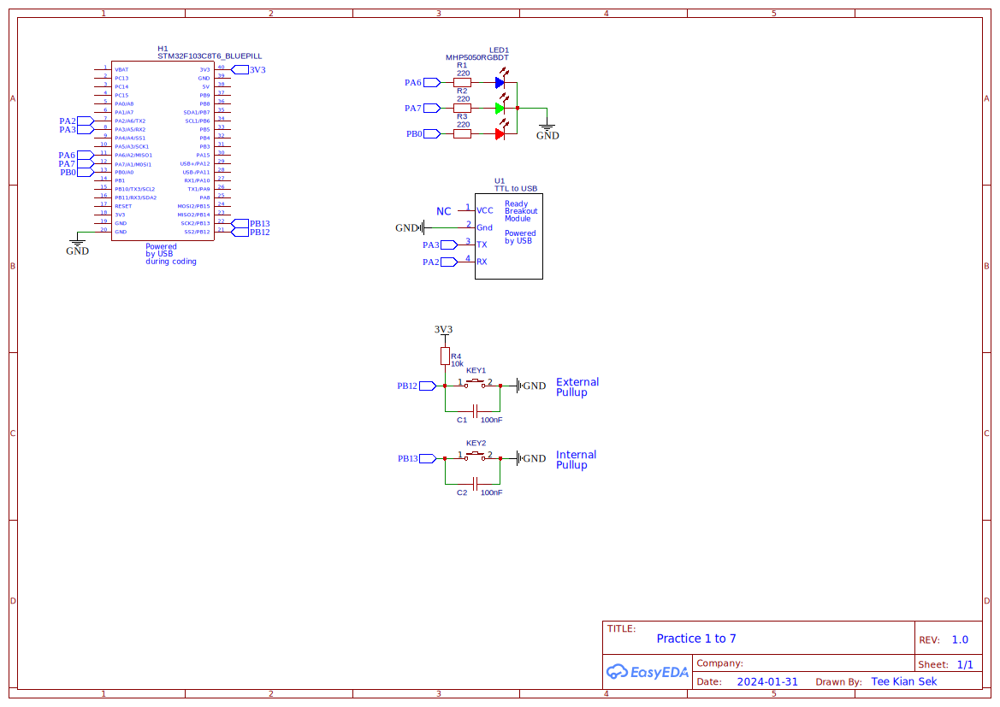

# STM32_intro_shared
## Author
Dr Tee Kian Sek  
Faculty of Electrical and Electronic Engineering   
Universiti Tun Hussein Onn Malaysia

### Note by the author
This is a non profit learning sharing.   
The author assumes no responsibility or liability for any errors or omissions in the content of this site. The information contained in this site is provided on an "as is" basis with no guarantees of completeness, accuracy, usefulness or timeliness.

# Title: Getting Start with STM32 using STM32CubeIDE and HAL

## Objectives
1. To learn the MCU and its registers
2. To deploy official ST IDE - namely STM32CubeIDE
3. To deploy official ST Hardware Abstract Layer (HAL)

The learners are encouraged to read the datasheets / manual and experiment the practices.
The learning path and knowledge are applicable to other STM32 MCU.  
Refer to the teaching module attached in the root directory - **STM32_Intro.pdf**   

[Click to jump to "STM32_Intro.pdf"](STM32_Intro.pdf)  

## Market Parts
The learners are urged to buy the market parts online. They are pretty cheap and easily available.

1. BluePill - STM32F103C8T6 x 1
2. ST-Link V2 - clone x 1
3. USB to UART Converter x 1
4. RGB breakout board x 1
5. Push button x 2
6. Resistor 1/4 W, 200 ~ 500 Ohm x 3
7. Resistor 1/4 W, 1k - 4.7k Ohm x 2
8. Breadboard x 1
9. Jumper wire
10. OLED 0.96", 128 x 64, I2C x 1

*Will add on as the practices expanding.*

Computer (laptop or desktop) - running Windows 11 with access to WiFi.

# Softwares
**ST**
1. STM32CubeIDE - Integrated Development Environment for STM32
   [https://www.st.com/en/development-tools/stm32cubeide.html]
2. STM32CubeProgrammer software for all STM32
   [https://www.st.com/en/development-tools/stm32cubeprog.html]
3. STM32 Flash loader demonstrator (UM0462)
   [https://www.st.com/en/development-tools/flasher-stm32.html]
5. STM32Cube initialization code generator
   [https://www.st.com/en/development-tools/stm32cubemx.html]
   No used in this learning.

**Third parties** 
1. Serial Terminal App - CoolTerm
   [https://coolterm.en.lo4d.com/windows]
2. Free serial port debug tool - eagleCom
   [http://www.mcuisp.com/English%20mcuisp%20web/ruanjianxiazai-english.htm]
   *My favour Serial Terminal App*
3. Free STM32 ISP software
   [http://www.mcuisp.com/English%20mcuisp%20web/ruanjianxiazai-english.htm]

# STM32CubeIDE
## Download and Install
First of all, download the last version of STM32CubeIDE from ST website. Follow the instructions and install.   
Create a specific folder in your computer as the workspace for all projects.   
Example:   
D:\STM32CubeIDE\workspace\

# MCU - STM32F103C8T6 aka BluePill

<table  style="width:100%;">
<tbody >
	<tr>
	    <td align="center">
			
	    </td>
	    <td align="center">
			
	    </td>
	</tr>
	<tr>
	    <td align="center">The MCU training board with STM32F103C8T6</td>
	    <td align="center">ST-Link V2 - Clone. The cheapest</td>
	</tr>
</tbody>
</table>

[Click to jump to "Schematic of STM32F103C8T6, aka BluePill"](documents/original-schematic-STM32F103C8T6-Blue_Pill.pdf)

## First Project
Refer to the module.   
[Click to jump to "STM32_Intro.pdf"](STM32_Intro.pdf)   

Jump to: 9 First Project - Create A New Project

Create the first project. Check for readiness if STM32CubeIDE, MCU and ST-Link (ISP) are ready!

# Practices
1. GPIO - LED
2. GPIO - LEDs Blink
3. GPIO - LED-Buttons
4. GPIO - EXTI
5. UART in Polling Mode
6. UART With Interrup
7. UART With DMA

*Will add on as the practices expanding.*

# Some Tricks
## Flash bin/hex file or erase a MCU or password-protected
1. Use a serial port via UART.

This is an important skill to reflash an MCU when we have accidentally disable SWD and ST-Link could not access the MCU. Disaster. Do not throw away the MCU. Instead, reflash it using UART. An USB-to-UART converter is needed.

2. Use ST-Link

Work if SWD is working.    
Deploying the app either - **Free STM32 ISP software** or **STM32CubeProgrammer**    
Functions - reflash, flash an MCU using BIN/HEX file, copy an MCU into BIN/HEX file, enable password-proctection (Not too sure)

## Duplicate a projec in STM32CubeIDE
It is a must-learned skill.  
For example, deploying project files shared by others and modify to suit our need.   

See module.

## Shortcut keys in the editor
Short cut keys are used to improve efficiency in coding. You may ignore them asa newbie.   
Shared a few in the module such as comment/uncomment.   
More are available in STM32CubeIDE - Help or simply google it.

# References
**Documents**   

For the MCU, STM32F103C8T6, two key documents are always referred:
1. datasheet - STM32F103 
2. RM0008 Reference manual

[Click to jump to "documents"](./documents/)  

Alternatively do search and download from ST website.

**Websites**
1. ST
   https://www.st.com/en/microcontrollers-microprocessors/stm32-32-bit-arm-cortex-mcus.html
2. ST Community
   https://community.st.com/

